# 🎨 Fine-tuning Stable Diffusion on My Chibi Drawings


<p align="center">
  
  <!-- 
   -->
</p>

---

## 📝 Project Description

This project fine-tunes **Stable Diffusion 1.5** on **15 hand-drawn chibi self-portraits** so the model learns to generate new images in my personal art style. It uses **LoRA (Low-Rank Adaptation)** via 🤗 `diffusers` + `peft` — a parameter-efficient method that produces a tiny ~30 MB adapter file instead of touching the base model weights.

The goal: a **simple, fast, reusable base project** for future style/character fine-tunings. The character trigger word is `thibchibi` — I use it in prompts to invoke the learned style.

---

## 🖼️ Training Dataset

15 hand-drawn chibi self-portraits used to fine-tune the LoRA adapter. The images below are the **original drawings** — the training pipeline resizes them to 512×512 with white padding before feeding them to the UNet.

<details>
<summary><b>📁 Click to view all 15 training drawings</b></summary>
<br>

<table align="center">
  <tr>
    <td align="center"><br><sub>Waving hello</sub></td>
    <td align="center"><br><sub>Waving hello (variant)</sub></td>
    <td align="center"><br><sub>Waving goodbye</sub></td>
  </tr>
  <tr>
    <td align="center"><br><sub>Waving goodbye 2</sub></td>
    <td align="center"><br><sub>Waving goodbye 3</sub></td>
    <td align="center"><br><sub>Waving goodbye 4</sub></td>
  </tr>
  <tr>
    <td align="center"><br><sub>Waving goodbye 5</sub></td>
    <td align="center"><br><sub>Waving goodbye 6</sub></td>
    <td align="center"><br><sub>Pointing at something</sub></td>
  </tr>
  <tr>
    <td align="center"><br><sub>Arms crossed</sub></td>
    <td align="center"><br><sub>Arms crossed, eyes closed</sub></td>
    <td align="center"><br><sub>Arms crossed, sunglasses</sub></td>
  </tr>
  <tr>
    <td align="center"><br><sub>Finger raised up</sub></td>
    <td align="center"><br><sub>Waiting patiently</sub></td>
    <td align="center"><br><sub>Looking surprised</sub></td>
  </tr>
</table>

</details>

---

## Example Outputs

Generated with the trained LoRA on top of vanilla SD 1.5 (`lora_scale=0.8`, 30 denoising steps, guidance=7.5).

<table align="center">
  <tr>
    <td align="center" colspan="4"><b>Prompt 1 — </b><i>"a thibchibi character drinking coffee, sunny day"</i></td>
  </tr>
  <tr>
    <td align="center">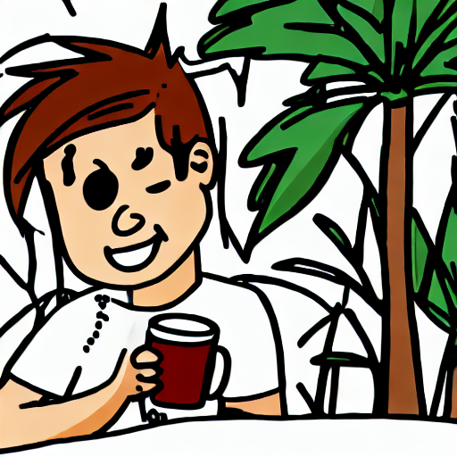</td>
    <td align="center">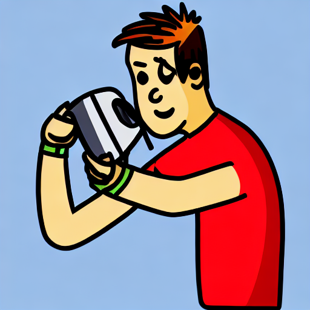</td>
    <td align="center">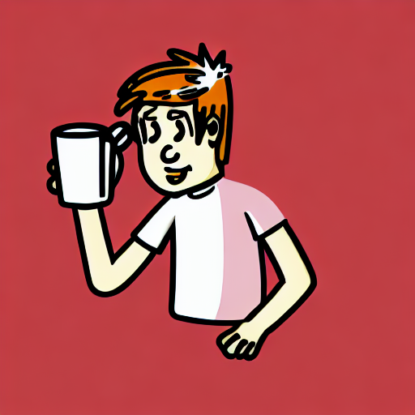</td>
    <td align="center">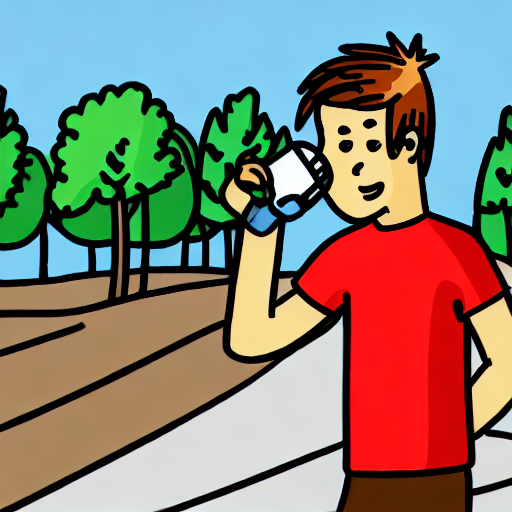</td>
  </tr>
  <tr>
    <td align="center" colspan="4"><b>Prompt 2 — </b><i>"a thibchibi character riding a skateboard"</i></td>
  </tr>
  <tr>
    <td align="center">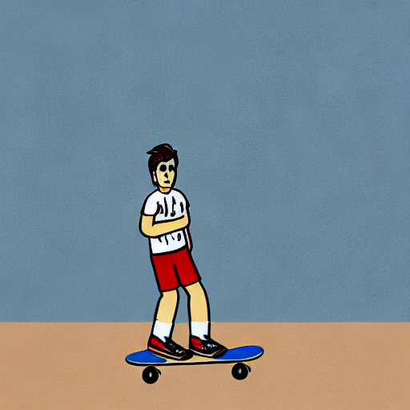</td>
    <td align="center">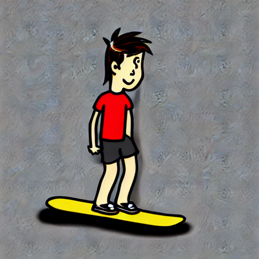</td>
    <td align="center">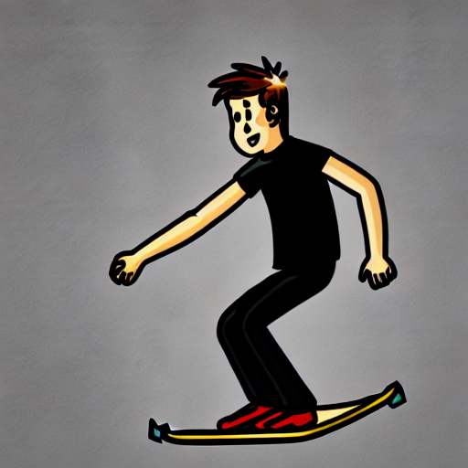</td>
    <td align="center">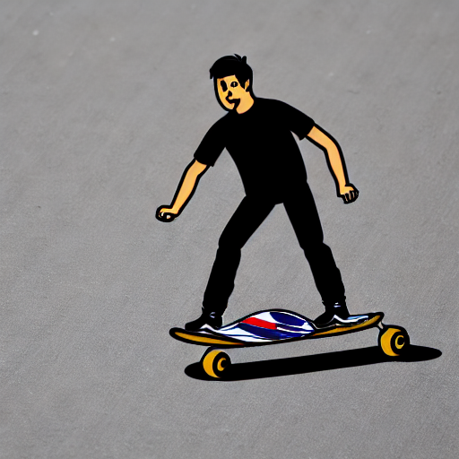</td>
  </tr>
</table>

### 📈 Training curves

<table align="center">
  <tr>
    <td align="center">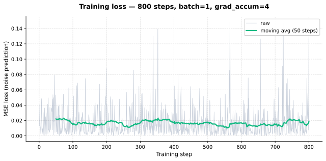</td>
    <td align="center">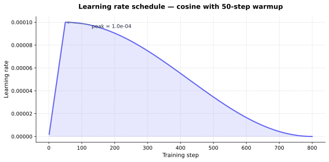</td>
  </tr>
</table>

### 📝 Notes & Observations

  📉 Loss is **very noisy** (batch size 1 on 15 images repeated → high variance per step). The 50-step moving average shows it stabilizes around 0.01-0.02.

  🎯 LoRA scale **0.8** gives the best balance — at 1.0 the style is overly saturated, at 0.5 it barely affects the output.

  🧪 The model **transfers the chibi style** but struggles with backgrounds/scenes outside the training distribution (15 images all on white backgrounds).

  💡 **Next steps to improve**: add data augmentation, enrich captions with backgrounds, train longer with `LORA_RANK=32`. See the "How to keep training" section.

---

## ✅ Highlights

  🎯 **Trained on RunPod for less than 1 €** (RTX A4000, ~7 min for 800 steps)

  🪶 **Final adapter is only ~30 MB** — base SD 1.5 weights are never touched

  ⚙️ **Reusable base project** — swap the dataset and trigger word to fine-tune another style/character in minutes

  🧪 **Full MLflow tracking** — loss curve, hyperparameters and gradients logged per run

  🖼️ **Gradio web demo** — load the LoRA once and tweak `lora_scale` live with a slider

---

## ⚙️ Features

  🎨 **LoRA fine-tuning** of Stable Diffusion 1.5 on a tiny dataset (15 images)

  ⚡ **Trigger-word approach** — single token (`thibchibi`) shared across all training images, captions auto-generated from filenames

  🪶 **Lightweight output** — final adapter ~30 MB, base SD model stays untouched and reusable

  💾 **VRAM-friendly** — fp16, gradient checkpointing, gradient accumulation → fits on a 6 GB GPU

  🧪 **MLflow tracking** — loss curves, hyperparams, sample images logged per run

  🖼️ **Gradio demo** — local web UI to test prompts with the trained LoRA loaded

---

## ⚙️ How it works

  🖼️ **15 chibi drawings** are resized to 512×512 with white padding to preserve their aspect ratio.

  📝 **Captions are generated automatically** from filenames (e.g., `Capture Au revoir 3.PNG` → `"a thibchibi chibi character, waving goodbye"`).

  🧠 **LoRA adapters** are injected into the attention layers of the Stable Diffusion **UNet** (`peft` `LoraConfig` with rank=16).

  🎯 The base SD model is **frozen** — only the LoRA weights (~0.8% of total params) are trained.

  📉 Training runs for **~800 steps** with AdamW (lr=1e-4), batch size 1, gradient accumulation 4 → effective batch 4. Total time ≈ **~7 min on an RTX A4000** (RunPod, < 1 €).

  🔮 **At inference**, the LoRA is loaded on top of vanilla SD 1.5, and prompts containing `thibchibi` produce images in the learned style.

---

## 🗺️ Architecture Diagram

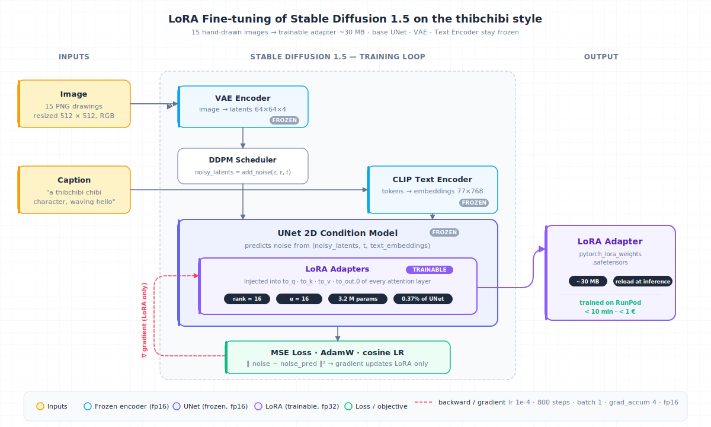

**Key hyperparameters** (see [src/config.py](src/config.py)):
- `BASE_MODEL = stable-diffusion-v1-5/stable-diffusion-v1-5`
- `TRIGGER_WORD = thibchibi`
- `LORA_RANK = 16`, `LORA_ALPHA = 16`
- `MAX_TRAIN_STEPS = 800`, `LEARNING_RATE = 1e-4`
- `MIXED_PRECISION = fp16`, `GRADIENT_CHECKPOINTING = True`

---

## 📂 Repository structure

```bash
├── assets/                     # SVG plots (loss, LR schedule) for the README
├── img/                        # Architecture diagram SVG
│
├── data/
│   ├── 1-raw/
│   │   └── my_drawings/        # 15 chibi PNG (input)
│   ├── 2-processed/            # generated dataset (512x512 + metadata.jsonl)
│   └── 3-external/
│
├── outputs/
│   ├── models/                 # LoRA adapter weights end up here
│   ├── logs/                   # MLflow runs
│   └── results/                # generated samples
│
├── src/
│   ├── config.py               # pydantic settings (paths + hyperparams)
│   ├── utils.py
│   ├── demo.py                 # Gradio web demo (live lora_scale slider)
│   ├── plot_training_metrics.py  # MLflow metrics -> SVG plots in assets/
│   ├── fix_mlflow_paths.py       # rewrite absolute paths after a cross-OS transfer
│   ├── data/
│   │   └── make_dataset.py     # PNG -> resize -> captions -> dataset HF
│   ├── models/
│   │   ├── model.py
│   │   ├── train.py            # LoRA fine-tuning loop + MLflow
│   │   └── generate.py         # CLI inference with --lora-scale, --no-lora
│   └── validation/
│       └── metrics.py
│
├── tests/
│
├── requirements.txt
├── LICENSE
└── README.md
```

---

## 💻 Run it on Your PC

Clone the repository and set up a Python environment:

```bash
git clone https://github.com/Thibault-GAREL/ILab_Formation_Fine-tuning.git
cd ILab_Formation_Fine-tuning

python -m venv .venv          # if you don't have a virtual environment
source .venv/bin/activate     # Linux / macOS
.venv\Scripts\activate        # Windows

pip install -r requirements.txt
```

⚠️ `torch` and `torchvision` are **not** in `requirements.txt` — install them separately so they match your CUDA version. For example with CUDA 12.1:

```bash
pip install torch torchvision --index-url https://download.pytorch.org/whl/cu121
```

⚠️ You need a **CUDA-compatible GPU** with at least **6 GB VRAM** to fine-tune locally. Otherwise, see the **Run it on RunPod** section below.

### 1. Prepare the dataset

```bash
python -m src.data.make_dataset
```

Reads `data/1-raw/my_drawings/`, writes resized images + `metadata.jsonl` into `data/2-processed/thibchibi_dataset/`.

### 2. Train the LoRA

```bash
python -m src.models.train
```

LoRA adapter saved to `outputs/models/lora_thibchibi/`. Training run logged to MLflow.

### 3. Generate images

```bash
python -m src.models.generate --prompt "a thibchibi character riding a bike"
```

### 4. Launch the Gradio demo

```bash
python -m src.demo
```

Then open [http://127.0.0.1:7860](http://127.0.0.1:7860) in your browser.

---

## 🚀 Run it on RunPod (cloud GPU)

If your local GPU isn't enough or you want to iterate faster, the same scripts run on a **RunPod cloud pod**. Recommended setup: **RTX A4000 (16 GB) ~$0.17/h** or **RTX 3090 (24 GB) ~$0.25-0.34/h** — both train SD 1.5 LoRA in ~5-10 min.

### 1. Pod setup (UI runpod.io)

- **Template** → `RunPod PyTorch 2.x` (image with torch + CUDA preinstalled)
- **GPU** → A4000 or RTX 3090
- **Container Disk** → 30 GB | **Volume Disk** → 30 GB (persistent `/workspace`)
- **Expose HTTP port** → `7860` (for the Gradio demo)
- **Add your SSH public key** in `User Settings → SSH Public Keys` (copy `~/.ssh/id_ed25519.pub`). ⚠️ The key is only injected when the pod **starts** — if you add it after starting, do **Stop + Start** (not Terminate, which deletes the volume).

### 2. Connect to the pod

```bash
ssh <POD_USER>@ssh.runpod.io -i ~/.ssh/id_ed25519
# Connection details (user + port) are in the pod's "Connect" panel.
```

### 3. Fix dependencies (CUDA mismatch is common on RunPod)

The RunPod image often ships with `torch` newer than `torchvision`, which breaks at import (`operator torchvision::nms does not exist`). Fix it:

```bash
# Check the CUDA version torch was built against
python -c "import torch; print(torch.version.cuda)"   # e.g., 13.0

# Reinstall torchvision aligned with torch's CUDA (replace cu130 by cu121 / cu124 / cu128 accordingly)
pip install --force-reinstall --no-deps torchvision --index-url https://download.pytorch.org/whl/cu130

# Remove bitsandbytes (not used here, and it fails to load on cu130)
pip uninstall -y bitsandbytes

# Verify
python -c "import torch, torchvision; print(torch.__version__, '|', torchvision.__version__); from torchvision.ops import nms; print('nms OK')"
```

### 4. Clone + install the project

```bash
cd /workspace
git clone https://github.com/Thibault-GAREL/ILab_Formation_Fine-tuning.git
cd ILab_Formation_Fine-tuning      # ⚠️ must cd before `python -m src.*` runs
pip install -r requirements.txt --ignore-installed blinker
```

<details>
<summary>💡 Why <code>--ignore-installed blinker</code> ?</summary>
<br>
On Debian/Ubuntu-based images, <code>blinker</code> is installed via <code>distutils</code> (apt) and pip refuses to overwrite it. <code>--ignore-installed blinker</code> tells pip to skip that uninstall step and just write the new version over the old files.
</details>

### 5. Run the full pipeline

```bash
python -m src.data.make_dataset
python -m src.models.train
python -m src.models.generate --prompt "a thibchibi character drinking coffee, sunny day" --num-images 4
```

<details>
<summary>📋 Expected training output (800 steps, ~5-10 min on A4000/3090)</summary>

```
Chargement de stable-diffusion-v1-5/stable-diffusion-v1-5 ...
Paramètres LoRA entraînables : 3,188,736 (0.37% du UNet)
Training 800 steps | 15 images | device=cuda
Mixed precision=fp16 | grad_accum=4

  step    1/800  |  loss=0.0126  |  lr=2.00e-06
  step   10/800  |  loss=0.0093  |  lr=2.00e-05
  ...
  step  800/800  |  loss=0.1278  |  lr=0.00e+00

LoRA sauvegardé -> outputs/models/lora_thibchibi
```

Warnings to safely ignore:
- `No LoRA keys associated to CLIPTextModel found` → expected, we only train UNet LoRA
- `enable_vae_slicing is deprecated` → still works in diffusers 0.38, will be migrated to `pipe.vae.enable_slicing()` later
- `filesystem tracking backend is deprecated` → MLflow note, harmless for local file logs
</details>

### 6. Retrieve outputs to your PC

SSH-based `scp` may fail with `Permission denied (publickey)` if the SSH key was uploaded after the pod started. The robust workaround is **`runpodctl`** (preinstalled on most RunPod templates, works without SSH).

**On the pod:**

```bash
cd /workspace/ILab_Formation_Fine-tuning
tar czf outputs.tar.gz outputs/
runpodctl send outputs.tar.gz
# -> prints a code like:  Code is: XXXX-word-word-word
# leave the terminal open until receive completes
```

**On your PC (PowerShell):**

```powershell
# First time only — download runpodctl for Windows
wget https://github.com/runpod/runpodctl/releases/latest/download/runpodctl-windows-amd64.exe -O runpodctl.exe

# Receive (paste the code from the pod), then extract + cleanup
.\runpodctl.exe receive <YOUR_CODE>
tar -xzf outputs.tar.gz
Remove-Item outputs.tar.gz
```

⚠️ Run the receive command **from your project directory** (e.g. `D:\...\ILab_Formation_Fine_tuning\`), otherwise `outputs/` lands in your home folder. If you already extracted elsewhere, move it back with:

```powershell
robocopy <wrong_path>\outputs <project>\outputs /E /MOVE
```

### 7. Inspect locally

```bash
# Activate your local virtual environment first (see "Run it on Your PC" above)

# MLflow UI — see the training run, loss curve, hyperparams
mlflow ui --backend-store-uri file:./outputs/logs/mlruns
# -> http://127.0.0.1:5000

# Reuse the trained LoRA locally (no re-training needed)
python -m src.models.generate --prompt "a thibchibi character on a beach" --num-images 2
```

### 8. ⛔ Stop the pod when done

In the RunPod UI:
- **Stop** → keeps `/workspace` (Volume Disk), pauses billing on GPU
- **Terminate** → deletes everything

Forgetting to stop the pod keeps the meter running. Set a billing alert.

---

## 📖 Inspiration / Sources

I used Claude Code to scaffold the LoRA fine-tuning pipeline (config, dataset prep, training loop) — the goal is to use this project as a **reusable base** for future style/character fine-tunings on small datasets.

Built on top of:
- 🤗 [diffusers](https://github.com/huggingface/diffusers) — Stable Diffusion implementation
- 🤗 [peft](https://github.com/huggingface/peft) — LoRA / parameter-efficient fine-tuning

Code created by me 😎, Thibault GAREL - [Github](https://github.com/Thibault-GAREL)
